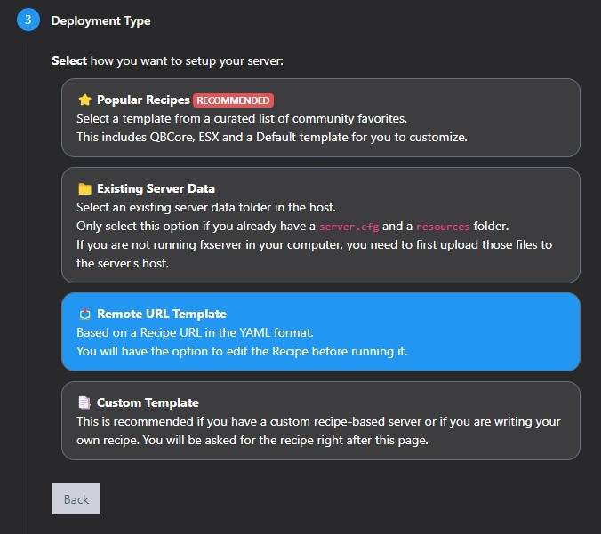

# ➡️ Instalação



Recomendamos fortemente usar **txAdmin** para instalar o seu servidor de FiveM.

Para saber como fazer isso confira [Setting up a server using txAdmin](https://docs.fivem.net/docs/server-manual/setting-up-a-server-txadmin/).



## 1 - Baixe os arquivos do servidor

Baixe o último Artefato do FiveM [Windows ](https://runtime.fivem.net/artifacts/fivem/build\_server\_windows/master/)/ [Linux](https://runtime.fivem.net/artifacts/fivem/build\_proot\_linux/master/) e extraia os arquivos.

## 2 - inicie a instalação do servidor

Execute \`FXServer.exe\` para iniciar e siga a instruções.

## 3 - Execute o deploy da receita

<figure><figcaption></figcaption></figure>

Use o link abaixo:


```
https://receita_aqui_em_breve
```


## 4 - Rode o servidor

Uma vez que você tenha completado a instalação, rode o servidor.
